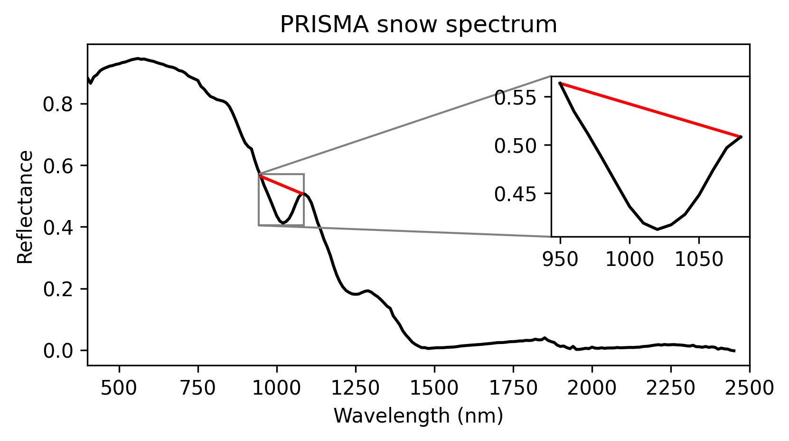
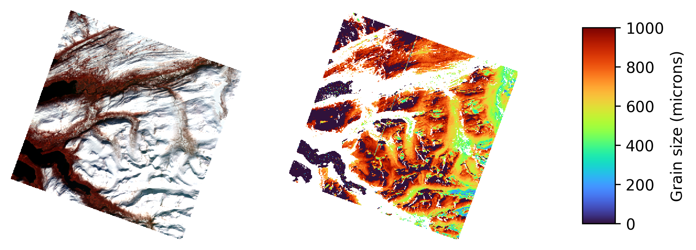

# SISTER Snow grain size PGE Documentation

## Description
The L2B snow grain size PGE takes as input surface reflectance and calculates snow grain size using the method of Nolin and Dozier (2000). Snow grain size is modeled as a function of scaled band area centered at the 1030 nm ice absorption feature:





### References 
- Nolin, A. W., & Dozier, J. (2000).
A hyperspectral method for remotely sensing the grain size of snow.
Remote sensing of Environment, 74(2), 207-216.
[doi.org/10.1016/S0034-4257(00)00111-5](https://doi.org/10.1016/S0034-4257(00)00111-5)
## PGE Arguments

In addition to required MAAP job submission arguments the L2A snow grain size PGE also takes the following argument(s):

|Argument| Type |  Description | Default|
|---|---|---|---|
| reflectance_dataset| file |L2A reflectance dataset | -|
| frcover_dataset| file |L2B fractional cover dataset| -|
| snow_cover| config |Snow fractional cover threshold| 0.9|


## Outputs

The outputs of the L2B snow grainsize PGE use the following naming convention:

    SISTER_<SENSOR>_L2B_GRAINSIZE_<YYYYMMDDTHHMMSS>_<CRID>

|Product description |  Units |Example filename |
|---|---|---|
| Snow grain size COGeotiff | - | SISTER_AVNG\_L2B\_GRAINSIZE\_20220502T180901\_001.tif |
| 1. Snow grain size  | microns | - |
| 2. Quality assurance mask  | - | - |
| Snow grainsize metadata  | - | SISTER_AVNG\_L2B\_GRAINSIZE\_20220502T180901\_001.met.json |
| Snow grainsize quicklook  | - |  SISTER_AVNG\_L2B\_GRAINSIZE\_20220502T180901\_001.png |
| PGE runconfig| - |  SISTER\_AVNG\_L2B\_GRAINSIZE\_20220502T180901\_001.runconfig.json |
| PGE log| - |  SISTER\_AVNG\_L2B\_GRAINSIZE\_20220502T180901\_001.log |

## Algorithm registration

This algorithm can be registered using the algorirthm_config.yml file found in this repository:

	from maap.maap import MAAP
	import IPython
	
	maap = MAAP(maap_host="sister-api.imgspec.org")

	grainsize_alg_yaml = './sister-grainsize/algorithm_config.yaml'
	maap.register_algorithm_from_yaml_file(file_path= grainsize_alg_yaml)

## Example

	grainsize_job_response = maap.submitJob(
	    algo_id="sister-grainsize",
	    version="1.0.0",
	    reflectance_dataset ='SISTER_AVNG_L2A_CORFL_20220502T180901_001',
	    frcover_dataset ='SISTER_AVNG_L2B_FRCOVER_20220502T180901_001',
	    snow_cover =0.9,
	    crid = '000',
	    publish_to_cmr=False,
	    cmr_metadata={},
	    queue="sister-job_worker-16gb",
	    identifier='SISTER_AVNG_L2B_GRAINSIZE_20220502T180901_001')
